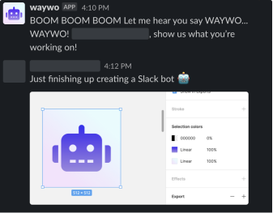

# Waywo Bot

Slackbot to share what individuals are working on across an organisation.

## Usage

Waywo can be deployed to Heroku or your own serverless environment and run via a cron job on a schedule.

## Setup

You will need to setup a Slack App in your workspace and create a Slack Bot User. The scopes required and app configuration can be found in `manifest.yml`. You will then need to create a public slack channel and invite the bot to that channel.

## Example

A random user from the channel will be asked to share what they are currently working on.

## Attributions

- `waywo-bot.png`, `waywo-bot-512x512.png` adapted from Font Awesome under Attribution 4.0 International (CC BY 4.0). See <https://fontawesome.com/license/free>
